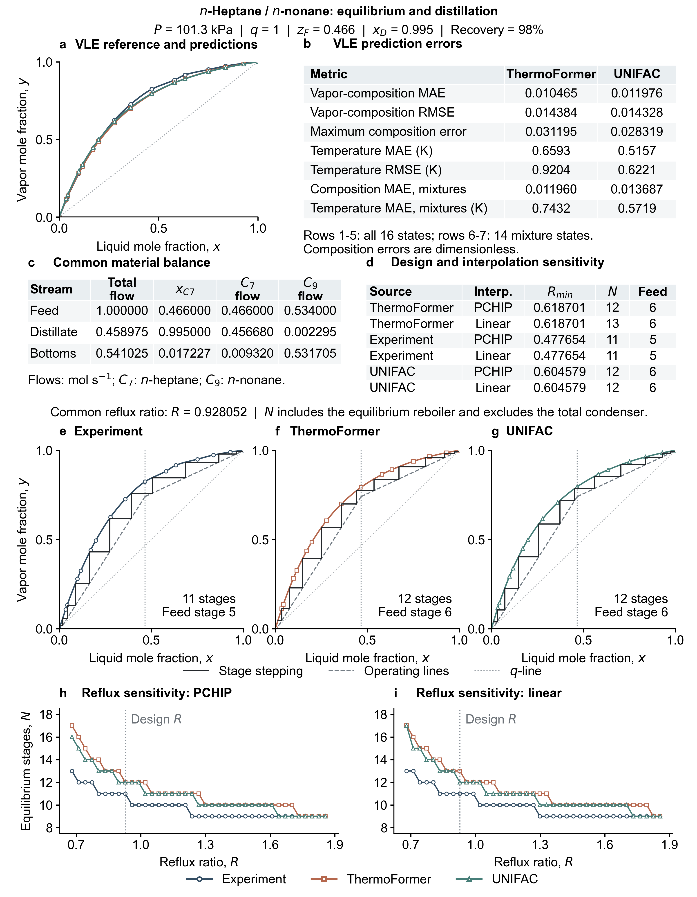

# n-Heptane / n-nonane binary distillation

**Manuscript Fig. 2a; SI S7.2 and Fig. S3.**

A saturated-liquid feed of 1 mol/s contains 0.466 mole fraction n-heptane at
101.3 kPa. The specified distillate heptane purity is 0.995 and its recovery
is 98%. Overall and heptane balances give D = 0.4589748744 mol/s,
B = 0.5410251256 mol/s and bottoms heptane fraction 0.0172265567.

Sixteen measured states, including both pure-component endpoints, define the
experimental equilibrium reference. ThermoFormer and original UNIFAC predict
bubble temperature and vapor composition using the measured liquid composition
and pressure. PCHIP and linear interpolation are compared for all three sources.
Minimum reflux is determined from contact of the operating lines and equilibrium
curve in both column sections. All designs use R = 0.9280520482, equal to
1.5 times the largest minimum reflux across the six curves.

| Source | Minimum reflux | PCHIP stages / feed stage | Linear stages / feed stage |
|---|---:|---:|---:|
| Experimental interpolation | 0.477654 | 11 / 5 | 11 / 5 |
| ThermoFormer | 0.618701 | 12 / 6 | 13 / 6 |
| UNIFAC | 0.604579 | 12 / 6 | 12 / 6 |

The 39 common reflux ratios span 1.10–3.00 times the largest minimum reflux,
in increments of 0.05. Three sources and two interpolation methods give 234
calculations. Counts include an equilibrium reboiler and exclude the total
condenser; numbering starts at the top. Constant molar overflow and q = 1 are
used. High-purity terminal regions depend on interpolation between available
states, so both interpolation results are retained.

| File | Contents |
|---|---|
| `data/equilibrium.csv` | All 16 measured x, y, T states; model y and bubble T; reference DOI |
| `data/model_inputs.json` | Molecular vectors, pure-property inputs, and registered checkpoint identifiers for fresh inference |
| `results/design.json` | Common specifications and all six source/interpolation designs |
| `results/stage_profiles.csv` | Every stage for all six designs, 71 rows |
| `results/reflux_sensitivity.csv` | All 234 reflux/stage-count records |
| `results/prediction_errors.json` | Composition and temperature errors over all states and mixture states |
| `figures/binary_distillation_summary.*` | SI Fig. S3 in three formats |

`x_heptane`, all y fields, and mole-fraction errors are dimensionless.
`T_exp_K`, `thermoformer_T_K`, and `unifac_T_K` are in kelvin; pressure is in kPa.
The complementary nonane fractions are 1 − x and 1 − y.
`binary.py` implements operating lines, pinch checks, inverse interpolation,
and graphical stepping. `reproduce.py --case binary` recalculates all designs
and sensitivity records from the table.

