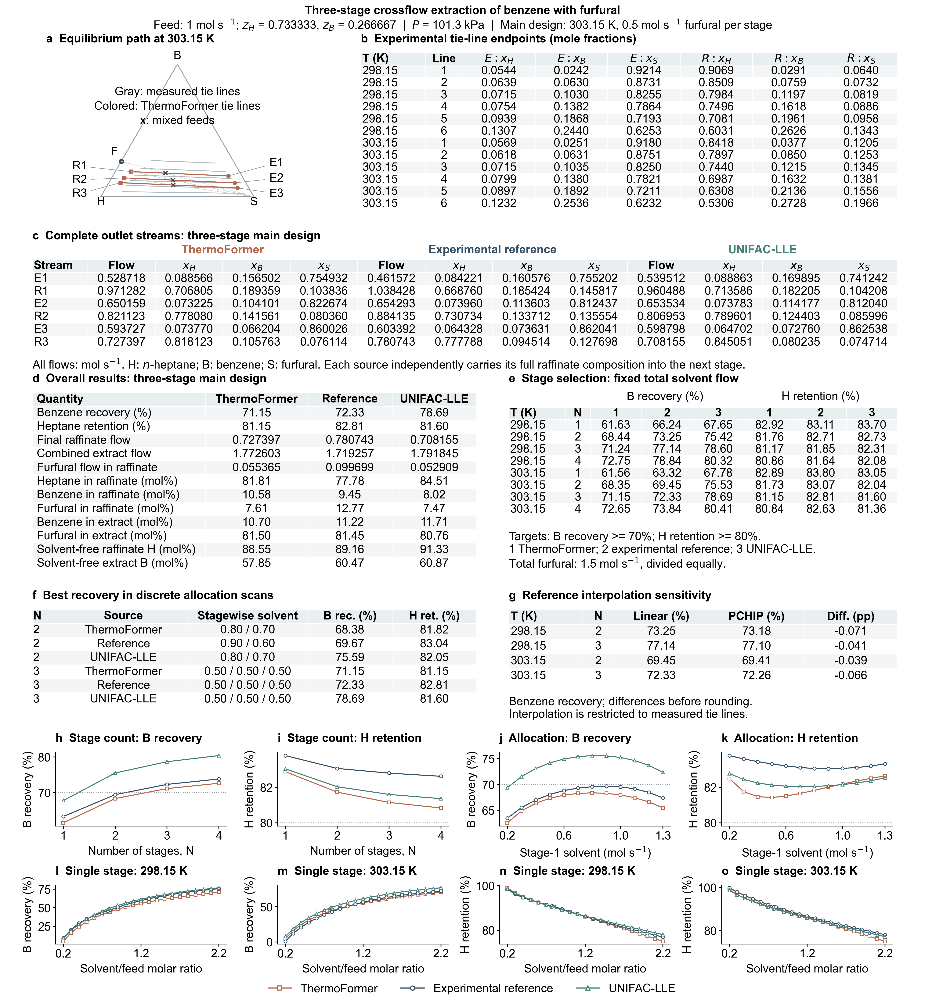

# n-Heptane / benzene / furfural crossflow extraction

**Manuscript Fig. 2c; SI S7.4 and Fig. S5.**

A 1 mol/s hydrocarbon feed contains 11/15 n-heptane and 4/15 benzene. The
retained design uses three isothermal equilibrium stages at 303.15 K and
101.3 kPa, each contacted with 0.5 mol/s fresh furfural. Extract streams are
withdrawn and combined; each source propagates its own raffinate to the next
stage. Targets are benzene recovery ≥70% and heptane retention ≥80%.

| Equilibrium source | Benzene recovery (%) | Heptane retention (%) |
|---|---:|---:|
| Experimental tie-line interpolation | 72.33 | 82.81 |
| ThermoFormer | 71.15 | 81.15 |
| UNIFAC-LLE | 78.69 | 81.60 |

At fixed total furfural flow of 1.5 mol/s, stages 1–4 are evaluated at both
298.15 and 303.15 K. At 303.15 K the experimental reference and ThermoFormer
first meet both targets with three stages, while UNIFAC-LLE does so with two.
At 298.15 K the experimental reference requires two stages and ThermoFormer
requires three. The agreement in stage selection is therefore temperature dependent.

The 303.15 K solvent-allocation study includes 12 two-stage allocations and
10 three-stage allocations for each source. The best two-stage recoveries for
ThermoFormer and the experimental reference remain below 70%. All three sources
give their highest recovery among the evaluated three-stage allocations at
0.5/0.5/0.5 mol/s. Single-stage dosage scans use 22 solvent/feed molar ratios
(0.2–2.2 in steps of 0.1, plus 7/9) at both temperatures.

The reference uses six measured tie lines per temperature, with interpolation
between adjacent lines only. PCHIP sensitivity for two/three-stage designs at
both temperatures changes benzene recovery by less than 0.08 percentage points.
Endpoint interpolation is an empirical reference and does not independently
certify chemical-potential equality or phase stability.

| File | Contents |
|---|---|
| `data/experimental_tie_lines.csv` | All 12 measured tie lines, both phases and all three components |
| `data/interpolation_protocol.json` | Measured endpoints and interpolation definition |
| `data/cascade_designs.json`, `data/cascade_stages.json` | 24 fixed-solvent designs and their 60 complete stage records |
| `data/allocation_designs.json`, `data/allocation_stages.json` | All 66 allocation comparisons and 162 stage records |
| `data/scan.json` | All 132 single-stage solvent-dose results |
| `data/reference_interpolation_sensitivity.json` | Four PCHIP sensitivity results |
| `results/*.csv` | Tabular copies of the complete design, allocation, dosage and sensitivity results |
| `results/main_design_streams.csv` | All 18 outlet streams of the retained design, with explicitly named component columns |
| `figures/furfural_extraction_summary.*` | SI Fig. S5 in PNG, PDF and SVG |

**JSON vector order is [heptane, furfural, benzene] (H, S, B).** CSV tie-line
columns name each component explicitly. The figure displays H, B, S and labels
those columns; do not infer JSON array order from their position in the figure.
T is in kelvin and all flows are mol/s. Recovery/retention fields are fractions,
not percentages. `xE` and `xR` are extract and raffinate compositions; `E` and
`R` are their flows. `S` is fresh solvent added to that stage and `total_S` is
the total solvent allocation. UNIFAC-LLE uses its LLE-specific interaction set,
with subgroup assignments recorded in `provenance.json`.

`extraction.py` implements the all-component lever rule, bounded experimental
interpolation and independent raffinate propagation. `reproduce.py --case extraction`
recalculates the full study from those equilibrium endpoints. Model-state lookup
rejects unavailable feeds; obtaining new model endpoints requires fresh inference.
Neither the endpoint table nor the lever rule supplies a general property package.

`lle_inference.py --model thermoformer --all` and `--model unifac --all`
independently recalculate all 74 configurations per model from their underlying
thermodynamic models. ThermoFormer uses its registered ternary-system checkpoint;
UNIFAC-LLE uses its published LLE-specific interaction data. Endpoint and
stability checks accompany the model calculation. These finite numerical
checks do not establish global stability over the continuous composition simplex.

