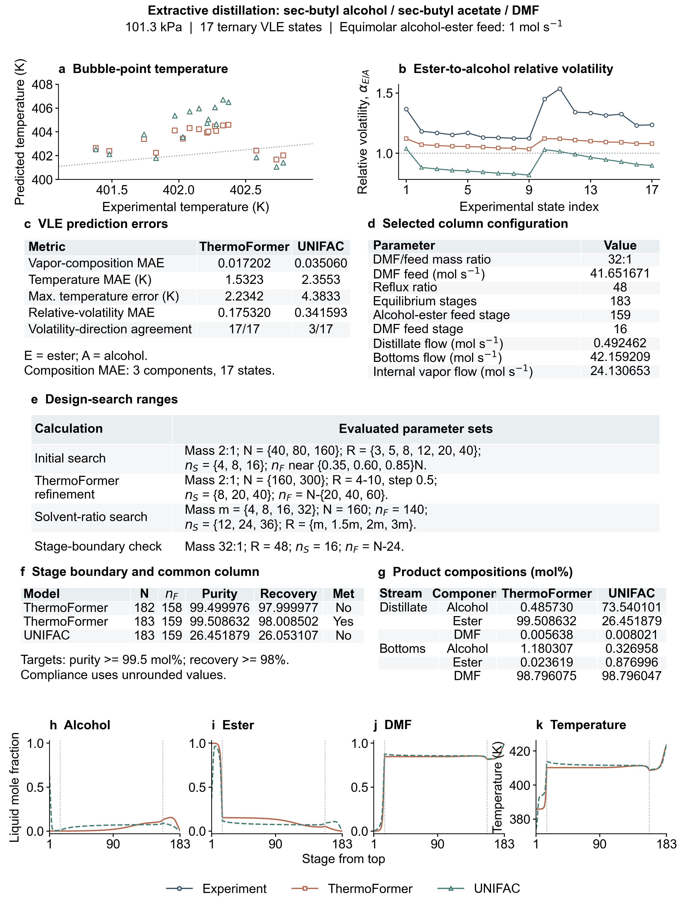

# sec-Butyl alcohol / sec-butyl acetate / DMF extractive distillation

**Manuscript Fig. 2b; SI S7.3 and Fig. S4.**

An equimolar alcohol/ester feed of 1 mol/s is separated at 101.3 kPa using pure
DMF above the feed. Both feeds have q = 1. The retained configuration has
DMF/feed **mass ratio 32:1** (DMF flow 41.651671 mol/s), R = 48, 183 equilibrium
stages, solvent at stage 16, and alcohol/ester feed at stage 159. The total
condenser is excluded and the equilibrium reboiler is included in N.
The target is ester purity ≥99.5 mol% and ester recovery ≥98%.

| Calculation | Main feed stage | Ester purity (mol%) | Ester recovery (%) | Both targets met |
|---|---:|---:|---:|---|
| ThermoFormer, 182 stages | 158 | 99.499976 | 97.999977 | No |
| ThermoFormer, 183 stages | 159 | 99.508632 | 98.008502 | Yes |
| UNIFAC, same 183-stage column | 159 | 26.451879 | 26.053107 | No |

Target compliance uses unrounded values. The minimum passing stage count
applies to the evaluated family with solvent at stage 16 and main feed at
N − 24. No UNIFAC configuration meeting both constraints was identified within
the evaluated search; this is not a proof of infeasibility for all designs.

At the 17 measured ternary VLE states, ThermoFormer has vapor-composition MAE
0.017202 and temperature MAE 1.5323 K; UNIFAC gives 0.035060 and 2.3553 K.
The ester/alcohol volatility direction agrees with experiment at 17/17 and
3/17 states, respectively. ThermoFormer uses its learned vapor-pressure branch
for alcohol and ester and an external correlation for DMF. UNIFAC uses its
associated pure-component vapor pressures. The comparison therefore includes
both activity-coefficient and vapor-pressure differences.

**All 183 stages of the retained ThermoFormer trajectory are outside the
experimental composition convex hull and temperature interval.** The measured
states assess equilibrium prediction in their covered region; they do not
validate the extrapolated column trajectory experimentally.

| File | Contents |
|---|---|
| `data/equilibrium.csv` | All 17 measured and predicted three-component VLE states; temperature and volatility errors |
| `data/thermoformer_182.json`, `data/thermoformer_183.json`, `data/unifac_183.json` | Complete configurations, all x/y/T stage states, product compositions and performance |
| `data/search_specification.json` | Parameter ranges shown in SI Fig. S4e |
| `data/*_surface.json` | Equilibrium grids for numerical column solution; final acceptance uses direct bubble evaluations |
| `data/model_inputs.json` | Exact molecular feature vectors, pure-property inputs, and checkpoint identifiers |
| `results/*_stages.csv` | Complete stage profiles, 182 + 183 + 183 = 548 rows |
| `results/comparison.json` | VLE error metrics, product target checks, stage balances and experimental coverage |
| `figures/sec_dmf_summary.*` | SI Fig. S4 in PNG, PDF and SVG |

Array order is **[sec-butyl alcohol, sec-butyl acetate, DMF]**. T is in kelvin;
S, D and B are mol/s, R is the molar reflux ratio; `nf` and `ns` are one-based
main-feed and solvent-feed stages. `xD` and `xB` are product mole fractions.
Grid coordinates are ester fraction on a solvent-free basis and DMF fraction.

`column.py` implements three-component stage balances (two independent residuals)
with a sparse Newton/least-squares solver. `solve_column.py` couples these balances
to the original equilibrium grids and direct bubble refinement. The default
`reproduce.py --case extractive` checks all archived stage balances, equilibrium
closure of saved ThermoFormer states, threshold outcomes and experimental coverage.

