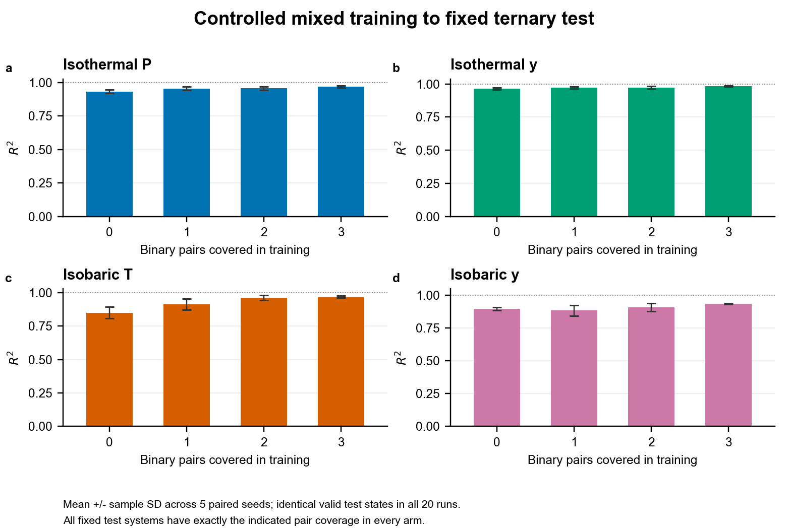

# Constituent binary-pair coverage and ternary VLE prediction

This study provides the results and reproducibility resources for **Fig. 3h-m and Supplementary Table S2** of the ThermoFormer manuscript. It tests whether increasing the coverage of constituent binary subsystems improves ternary vapor-liquid equilibrium (VLE) prediction under mixed binary-ternary training.

## Results: Supplementary Table S2

Values are the mean and **sample standard deviation** of R² over five paired random seeds. Every condition is evaluated on the same 517 ternary test points: 207 isothermal and 310 isobaric observations. All 20 trained models return converged, physically valid predictions for these points.

| Prediction target | 0 pairs | 1 pair | 2 pairs | 3 pairs |
|---|---:|---:|---:|---:|
| Isothermal P | 0.9325 ± 0.0139 | 0.9549 ± 0.0131 | 0.9559 ± 0.0122 | **0.9682 ± 0.0085** |
| Isothermal y | 0.9639 ± 0.0076 | 0.9704 ± 0.0072 | 0.9735 ± 0.0100 | **0.9838 ± 0.0039** |
| Isobaric T | 0.8506 ± 0.0440 | 0.9148 ± 0.0414 | 0.9625 ± 0.0177 | **0.9686 ± 0.0081** |
| Isobaric y | 0.8962 ± 0.0123 | 0.8838 ± 0.0393 | 0.9077 ± 0.0311 | **0.9346 ± 0.0043** |

Full coverage outperforms zero coverage for every target in every seed. The largest mean improvement is in isobaric temperature. Isobaric vapor-composition R² is nonmonotonic at intermediate coverage levels. These results support a benefit of constituent-pair coverage **under mixed training**, rather than a claim that binary-only training is sufficient for ternary prediction or that every added pair must improve every prediction.



[Table S2 data](results/R2_summary.csv) · [Seed-resolved R²](results/per_seed_R2.csv) · [Paired differences](results/paired_changes.csv) · [Full Fig. 3](figures/figure_3.pdf)

## Controlled comparison

| Quantity | Specification |
|---|---|
| Coverage levels | 0, 1, 2 or 3 constituent binary pairs per test system |
| Seeds | 0, 1, 2, 3, 4; matched initialization across coverage levels |
| Test set | 12 ternary systems; 517 fixed observations |
| Training set | 8,238 observations per run: 7,595 binary and 643 ternary |
| Validation set | 1,303 fixed observations |
| Molecular exposure | Identical training-component identities at all coverage levels |
| System separation | Training, validation and test mixtures are disjoint |
| Model selection | Validation data only |

An unordered pair of canonical isomeric SMILES identifies each binary subsystem. A test ternary mixture has three such pairs. The common training background excludes all target pairs, including pair occurrences embedded in other ternary training mixtures. Validation data also exclude these pairs. Other ternary training observations remain fixed.

Target pairs are assigned three entry ranks so that each target ternary mixture has one pair at each rank. Up to 20 existing observations are sampled without replacement for each target binary pair. Increasing coverage adds nested subsets of these observations and replaces an equal number of non-target binary observations. Thus the total training size, binary/ternary counts, component exposure, validation set and test set are held fixed. Pair entry orders and target-observation subsampling vary across the five seeds. The intervention replaces background binary observations with target-pair observations; it does not independently isolate pair count from target-pair sampling density or exactly match thermodynamic-state distributions.

The study uses the repository's VLE filtering and pure-anchor criteria (`failed_weight=0`, `max_pressure_kpa=500`, at least two pure-anchor temperatures). Eligibility requires all three constituent pairs to be available and each component to remain represented in the non-target training background. Exact identities, assignments and sampling specifications are in [design.json](design.json) and [splits/](splits/).

## Training and evaluation

Each model is trained independently from random initialization. Supervised initialization uses 80 epochs, followed by Stage 1 direct thermodynamic supervision (20 epochs), Stage 2 joint thermodynamic/VLE supervision (80 epochs), and Stage 3 fugacity-constrained fine-tuning (10 epochs). Early stopping is disabled so that all arms have equal epoch budgets. Stage-local and final checkpoints are selected using the same validation criteria as the ThermoFormer staged-training implementation.

The batch size is 128. Supervised training uses AdamW with a base learning rate of 2 × 10⁻⁴, weight decay of 10⁻⁴ and gradient clipping at 5. The Stage 3 module-specific learning rates and all architecture and objective settings are preserved in each run's `resolved_config.json`. No previously trained VLE checkpoint is used for initialization.

The frozen molecular representation concatenates 24 RDKit descriptors, 768 Uni-Mol v2 features and 28 functional-group features. Descriptor scaling is fitted on the zero-coverage background training molecules and shared by all arms. [features/](features/) contains the exact prepared arrays and preprocessing metadata, allowing inference and retraining without regenerating conformers.

R² is calculated separately for each seed and prediction target, then averaged across seeds. Pressure and temperature use scalar state-level observations; vapor-composition R² pools the three component mole fractions. Sample standard deviations use a denominator of n − 1. The comparison uses the intersection of converged, physically valid test predictions across all runs; this intersection contains all 517 reference points. Unrounded data are retained in CSV files, including negative values wherever they occur.

## F01: acetic acid / water / DMSO

Fig. 3h compares 17 held-out bubble-temperature measurements at 13.33 kPa with predictions from mixed and ternary-only training for seeds 1 and 4. These are the manuscript's mixture-order experiments, distinct from the controlled coverage arms in Table S2.

Fig. 3m reports **training-record counts containing each constituent pair**, including occurrences within ternary records:

| Model | Acetic acid-water | Acetic acid-DMSO | Water-DMSO |
|---|---:|---:|---:|
| Mixed, seed 1 | 104 | 15 | 16 |
| Mixed, seed 4 | 124 | 0 | 16 |
| Ternary-only, seed 1 | 30 | 0 | 0 |
| Ternary-only, seed 4 | 50 | 0 | 0 |

These record counts must not be interpreted as the binary-only training coverage used to define the controlled arms. The temperature parity and record-count source data are supplied in [source_data/](source_data/).

The source VLE study accounts for acetic acid vapor-phase association using the Hayden-O'Connell method ([source DOI](https://doi.org/10.1016/j.fluid.2008.09.010)). ThermoFormer's activity-coefficient targets use an ideal-vapor approximation and can partly absorb omitted vapor-phase effects. This provides a possible additional explanation for the residual F01 error. No HOC-corrected model comparison is reported here.

## Reproduction

Install the repository environment and retrieve Git LFS artifacts as described in the [repository README](../../../../README.md). Run the following commands from the repository root.

Verify artifact identities, fixed controls, coverage assignments, validation-selected stages and Table S2:

```bash
python experiments/vle/ablation/binary_pair_coverage/scripts/study.py verify
```

Recalculate Table S2 and regenerate the controlled-coverage panels from archived predictions:

```bash
python experiments/vle/ablation/binary_pair_coverage/scripts/study.py report --output-dir outputs/pair_coverage_report
```

Regenerate the fixed splits in a separate directory:

```bash
python experiments/vle/ablation/binary_pair_coverage/scripts/build_splits.py --output-dir outputs/pair_coverage_splits
```

Evaluate a supplied validation-selected checkpoint:

```bash
python experiments/vle/ablation/binary_pair_coverage/scripts/study.py predict --seeds 0 --coverages 0 --device cuda --output-dir outputs/pair_coverage_predictions
```

Retrain an arm using the archived configuration and frozen features; omitting `--seeds` and `--coverages` trains all 20 arms:

```bash
python experiments/vle/ablation/binary_pair_coverage/scripts/study.py train --seeds 0 --coverages 0 --device cuda --output-dir outputs/pair_coverage_retraining
```

Use a fresh output directory for each model execution. Reference artifacts are never overwritten. Floating-point results from retraining can depend on the PyTorch/CUDA version and hardware; the archived predictions define the reported Table S2 values.

## Files and manuscript correspondence

| Location | Contents | Manuscript correspondence |
|---|---|---|
| `results/R2_summary.csv` | Five-seed means and sample standard deviations | Table S2; Fig. 3i-l |
| `results/per_seed_R2.csv`, `paired_changes.csv` | Paired seed-level evidence | Full-versus-zero coverage comparison |
| `results/seed_*/coverage_*/` | Per-point predictions, configuration and validation selection | Reproduction of Table S2 |
| `splits/`, `design.json` | Fixed sample identities and intervention assignments | Controlled mixed-training experiment |
| `checkpoints/`, `features/` | Final selected weights and frozen molecular features | Inference reproduction |
| `source_data/figure_3h_F01_temperature.csv` | F01 temperature parity source data | Fig. 3h |
| `source_data/figure_3m_F01_pair_records.csv` | F01 pair-containing record counts | Fig. 3m |
| `source_data/figure_3_ag_R2.csv` | VLE/LLE overview R² data | Fig. 3a-g; Tables S1 and S3 |
| `figures/` | Controlled-coverage plots and manuscript Fig. 3 | Fig. 3 |
| `provenance.json`, `artifact_manifest.json` | Scientific settings and artifact SHA-256 digests | Reproducibility |

This is an exploratory controlled study on the specified eligible mixtures. The results should not be generalized to unseen molecules, other state domains or binary-only training without additional evidence.
